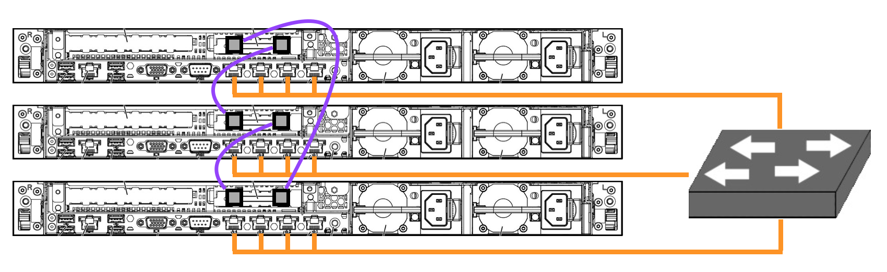

# Homelab

This repo holds the description and code used to build my home lab.

## Summary

The current setup uses 3 HP DL360e Gen8 servers, a virtualized network gateway / firewall running [OPNsense](https://opnsense.org/), an LXC container doing DNS over HTTPS using [cloudflared](https://github.com/cloudflare/cloudflared). Additionally, I have a number of VMs for testing and internal services.

My previous setup was using almost 770W of energy in an idle state. The operating costs were high and I wanted to reduce this while also improving my existing setup. The main goals were:

- Reduce energy usage
- Maintain local data redundancy (disk or block mirroring)
- Enable high-availability by reducing single points of failure

For more information, see my [previous setup](#previous-setup).

This repo and implementation is inspired by [Brad's Homelab](https://github.com/bradfitz/homelab).

### Energy Usage

|   | Previous | Current | Savings |
|---|---|---|---|
| Avg. Power | 770 W | 550 W | 220 W |
| Annual Energy | 6745 kWh | 4818 kWh | 1927 kWh |
| Annual Cost | $613.80 | $438.44 | **$175.36** |

I have high hopes that my operating cost reductions can pay for the new hardware in about 3 years. My current energy rate is very low at 9.1 cents per kWh making recouping expenses in new hardware a challenge.

## Hardware

**Servers**

- 3x HP DL360e Gen8
  - 2x Intel Xeon E5-2407 (8 cores @ 2.2GHz)
  - 24GB of memory
  - 4x gigabit NICs
  - Emulex / HP NC552SFP 8x PCIe 10Gb 2-port SFP+ adapter
  - Crucial MX500 250GB M.2 SSD SATA drive
  - 1x Dual M.2 to PCIe adapter - NVMe and SATA (power only)

The operating system is installed on the M.2 SATA SSD. In order to boot to the onboard SATA port, either an array must be configured in the Smart Array B120i RAID controller, or the RAID controller must be disabled and SATA mode enabled.

**Network**

- HP ProCurve J9021A 2810-24G
  - Version N.11.78
  - 24 gigabit ports
- 2x Ubiquiti Networks UniFI UAP-AC-PRO-US
  - 802.11 a/b/g/n/ac 2.4Ghz / 5GHz
  - 3x3 MIMO
  - PoE Powered (802.3af / 803.2at)

In lieu of an expensive 10Gb switch, my plan was to create a small mesh network. It's actually a small ring topology network, but it's so small that it is also a mesh. If this were extended to include a fourth server, it would be a ring.

The 4x 1Gb network interfaces on each server are bonded using  [LACP (802.3ad)](https://en.wikipedia.org/wiki/Link_aggregation) with the switch.

The two APs cover my 2-story house with a basement well with one unit mounted on the ceiling of the second floor, and another mounted on the ceiling in the basement.

**Network Attached Storage**

- Supermicro SC826 2U chassis with SAS-826A backplane
  - FreeNAS 11.1
  - 2x Intel Xeon L5620 CPUs (8 cores @ 2.13GHz)
  - 24GB of memory
  - 32GB M.2 SATA SSD (boot drive)
  - SAS-826A backplane
  - 2x Seagate ST6000NM0034 6TB 7200 RPM SAS drives in ZFS mirror

This system is my home NAS and previously hosted all VM images and an SMB file share used to store photos and documents. It is still used for SMB but will be transitioned away at some point.

## Network

The network is made up of several VLANs.

- VLAN 1 - HOME - Unused / management
- VLAN 4 - GUESTS - Wireless guests
- VLAN 10 - GENERAL - General purpose LAN
- VLAN 20 - STORAGE - SAN / Ceph traffic
- VLAN 30 - PVECLUSTER - Proxmox VE / corosync
- VLAN 60 - CAMERAS - IP cameras
- VLAN 70 - EDGE - Internet edge
- VLAN 90 - DEVICES - Devices / IoT

## Software

- Debian 10 Buster
  - Proxmox VE 5.x
  - Ceph

### Virtual Machines

**Network Gateway**

- OPNsense 19.7
  - 4 vCPU
  - 4GB memory
  - 1x 32GB ATA Block Device
  - 4x VirtIO Network Interface

I originally tried running Sophos XG Home Edition (free), but didn't like it after using it a couple months.

## Previous Setup

The current revamp of my lab is my fourth major revision to my home lab. My previous setup (version 3.x) consisted the following hardware and software:

**Virtual Machine Server**

- Dell PowerEdge R900
  - XenServer 6.x
  - 4x Intel Xeon E7330 CPUs (16 cores @ 2.4GHz)
  - 24GB of memory
  - 2x 73GB 10k RPM SAS drives in RAID 1

This was a natural migration for me as I was using Xen in my previous lab. Using XenServer came with some drawbacks including the need to run the XenCenter management application on a Windows VM. This system had multiple gigabit NICs, but only one was used.

**Network Attached Storage**

- Supermicro SC826 2U chassis with SAS-826A backplane
  - FreeNAS 11.1
  - 2x Intel Xeon L5620 CPUs (8 cores @ 2.13GHz)
  - 24GB of memory
  - 32GB M.2 SATA SSD (boot drive)
  - SAS-826A backplane
  - 2x Seagate ST6000NM0034 6TB 7200 RPM SAS drives in ZFS mirror

**Network Gateway**

- INFOBLOX-550-A
  - Sophos UTM 9.6
  - Intel Celeron @ 2.93GHz
  - 2GB of memory
  - SanDisk SDSSDA120G 120GB SSD SATA drive

I picked this up for $25 on eBay a few years ago and decided to use it as my gateway. It is just a small Supermicro motherboard, but it lacks things like a video-out port making it difficult to use. There was a password on the BIOS that is built into the ROM and can't be reset. The SSD drive was mounted with double-sided tape inside the chassis.

**Network Switch**

- HP ProCurve J9021A 2810-24G
  - 24 gigabit ports

This switch supports VLAN assignments, SSH, and some other features. It might stick around in the new lab for a while.

**Wireless Access Points**

- 2x Ubiquiti Networks UniFI UAP
  - 802.11 b/g/n 2.4GHz
  - 2x2 MIMO
  - PoE Powered (UniFi 24V)
